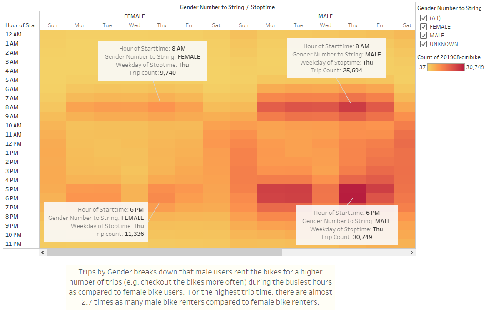

# Bicycle Sharing in Des Moines

## Overview of Analysis:

Using Tableau to visualize the analysis of the bike sharing program Citibike in New York City.  

### Purpose:

Using Tableau to visually present the analysis findings of the bike sharing program Citibike in New York City.  The analysis and visualizations are used to propose starting a similar bike-sharing business in Des Moines.

Tableau story link: https://public.tableau.com/profile/flora8857#!/vizhome/Module14Challenge_16142243773250/Citibike?publish=yes    

## Analysis Results and Challenges:

Eight total visualizations are gathered together in a Tableau story to provide details into the Citibike bike-sharing program in New York City.  These elements provide insight into establishing a similar bike share program in Des Moines.

### Analysis Results

-- Top Start and End Location maps dashboard: Shows higher trip demand in the Manhattan area (approximately around the Grand Central Station area).  This area garners demand from various sources (e.g. tourists, commuters, etc.), providing consumer demand for the bicycles throughout the week.
Tableau link: https://public.tableau.com/profile/flora8857#!/vizhome/Module14Challenge_16142243773250/TopStartandEndLocations

-- Trips by Weekday per Hour:  Illustrates highest demand (number of trips) during the weekdays primarily during "commuting" hours of 8am and 5-6pm.  Additionally, there is medium-level demand on the weekends from 10am-5pm, which could be perceived as prime tourist or personal errand execution time.
Tableau link:  https://public.tableau.com/profile/flora8857#!/vizhome/Module14Challenge_16142243773250/TripsbyWeekdayperHour

-- Trips by Gender:  Breaks down that male users rent bicycles for a higher number of trips (e.g. higher number of bicycles checkout counts) during the busiest days and hours as compared to female bicycle users.  For the highest trip day/time, there are almost 2.7 times as many male bike renters compared to female bike renters.
Tableau link:  https://public.tableau.com/profile/flora8857#!/vizhome/Module14Challenge_16142243773250/TripsbyGenderWeekdayperHour

-- Checkout Times for Users:  Shows the majority of bicycles are checkout for a duration of 20 minutes or less.  Zero bikes are checked out for usage durations greater than 1.5 hours long.
Tableau link:  https://public.tableau.com/profile/flora8857#!/vizhome/Module14Challenge_16142243773250/CheckoutTimesforUsers

-- Checkout Times by Gender:  Further confirms that Male users rent the highest number of bicycles with a majority of checkout times less than 20 minutes in duration.  But this additional gender breakdown reveals, that a majority of bicycle checkout durations for Female users is less than 15 minutes and for unspecified Gender customers there is a plateau in the 10-30 minute checkout duration window. 
Tableau link:  https://public.tableau.com/profile/flora8857#!/vizhome/Module14Challenge_16142243773250/CheckoutTimesbyGender

-- User Type Trips by Gender:  Breaks down the users by type and gender revealing that male subscribers check out the highest number of bicycles during weekdays when compared to female or unspecified users between customer and subscriber user types.  In general, the Subscriber user type checkout bicycles more often.  On the busiest weekday, Thursday, male subscribers check out approximately 12 times more bikes than male customers.  And on the busiest weekend day, Saturday, male subscribers check out approximately 4 times more bikes than male customers.
Tableau link:  https://public.tableau.com/profile/flora8857#!/vizhome/Module14Challenge_16142243773250/UserTripsbyGenderbyWeekday

-- Bike Utilization:  Illustrates each bicycle's total usage time.  A bicycle's total usage time can be used to schedule the frequency of preventative maintenance checks or schedule the bike's replacement, to avoid users experiencing any equipment issues during their trips.  Coupled with the previous visualizations, the bike utilization can also provide a schedule for bike repair/preventative maintenance during the weekends when a full fleet of bicycles are not required to cover the demand.
Tableau link:  https://public.tableau.com/profile/flora8857#!/vizhome/Module14Challenge_16142243773250/BikeUtilization

#### Top Starting and Ending Locations Maps

#### Trips by Weekday per Hour

#### Trips by Gender

#### Checkout Times for Users

#### Checkout Times by Gender

#### User Type Trips by Gender

#### Bike Utilization

### Challenges and Difficulties Encountered

No challenges were encountered during the analysis.

The results of converting the 'Tripduration' column datatype to a datetime datatype are held within a separate column, 'Trip Duration', to support the various visualizations against the two different trip duration datatypes.  The updated csv file including the new 'Trip Duration' datetime column has been uploaded using git lfs.

## Summary
The analysis provides details that can be applied for the business proposal of starting a bicycle sharing program in Des Moines. Making bicycles available in high traffic areas with multiple sources of demand will help pinpoint the best locations to start this program in Des Moinse.  For examples city areas where customers are commuters, tourists, and individuals needing to navigate a finite area that is more easily navigatable by bicycle as opposed to cars. Additional consideration are locations near to mass transit stations where mass transit brings individuals into the city, but then the bikes are handily available for local use.  Since a majority of bicycles were checked out for less than 30 minutes, multiple prime locations that are within a 20-30 minute bicycle ride radius would be an ideal area to begin.  A majority of the New York City users were male subscribers to the program, so additional advertising should be reviewed to promote the bicycle usage amongst female users and short term customers (e.g. visitors) to broaden the opportunities in Des Moines.  Also, the details of a bicycle subscription program should be further reviewed to put into place.  Beyond the analysis details, with the growing concerns on climate change and promotion of green transportation options, a bicycle sharing program for local use within high traffic city areas is an appealing option for a broad range of customers.

Two additional visualizations that can be performed include:

1. Visualization that further breaks down Gender and Birth Year for the number of trips taken to determine if there is a targeted user age range that are the predominant users of a bike sharing program.  Or if a different type of bicycle is needed to appeal to broader age ranges.

2. Visualization that breaks down the number of rides taken per user type (i.e. Customer and Subscriber) during the week with a further overlay on Starting Location to understand if there are certain start locations that are more favored by Customers versus Subscribers.  This can support understanding the supply of bikes needed in different areas during the week based on anticipated demand. 
